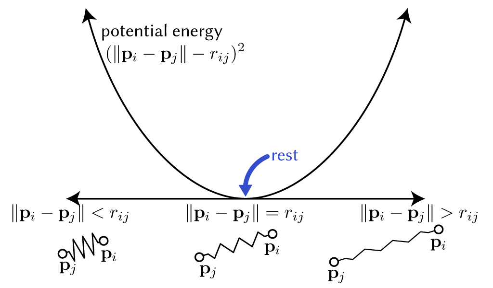
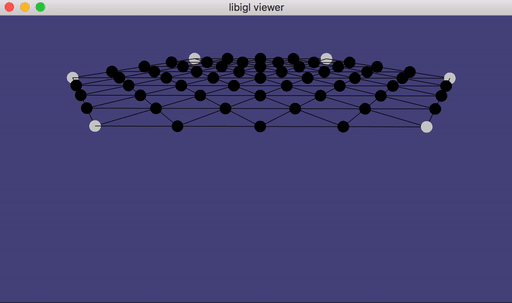
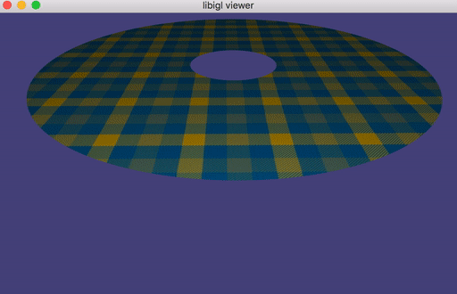

# Computer Graphics – Mass-Spring Systems

> **To get started:** Clone this repository using
> 
>     git clone --recursive http://github.com/alecjacobson/computer-graphics-mass-spring-systems.git
>


## Background

### Read Chapter 16.5 of _Fundamentals of Computer Graphics (4th Edition)_.

### Read ["Fast Simulation of Mass-Spring Systems" [Tiantian Liu et al. 2013]](http://graphics.berkeley.edu/papers/Liu-FSM-2013-11/Liu-FSM-2013-11.pdf)

### Mass-Spring Systems

In this assignment we'll consider animating a deformable shape.

We _model_ the shape's physical behavior by treating it as a network of [point
masses](https://en.wikipedia.org/wiki/Point_particle) and
[springs](https://en.wikipedia.org/wiki/Effective_mass_(spring–mass_system)). We
can think of our shape as a
[graph](https://en.wikipedia.org/wiki/Graph_(discrete_mathematics)) where each
vertex is a point mass and each edge is a spring.

Given _initial conditions_ (each point's starting position and starting
velocity, if any) we will create an animation following the laws of physics
forward in time. In the real world, physics is deterministic: if we know the
current state, we can be sure of what the next state will be (at least at the
scales we're considering). This will also be true of our physical simulation.

The law that we start with is Newton's second law, which states that the forces
 acting on a body must equal its mass  times its acceleration
:


<p align="center"></p>

Notice that  and  are vectors, each having a magnitude and a direction.
We will build our computational simulation by asking for this equation to be
true for each point mass  in our network. The forces  acting on the -th point
mass are simply the sum of forces coming from any incident spring edge  and
any external force (such as gravity).

[Personifying](https://en.wikipedia.org/wiki/Personification) physical objects, we say
that they are _at rest_ when their potential energy is zero. When the object is
_not at rest_ then it exerts a force pushing it toward its rest state ([elastic
force](https://en.wikipedia.org/wiki/Elasticity_(physics))), decreasing its
potential energy as fast as possible. The force is the negative gradient of the potential
energy.

A simple spring is defined by its stiffness  and _rest_ length .
Its potential energy measures the squared difference of the current length and
the rest length times the stiffness:

<p align="center"></p>



The force exerted by the spring on each mass is the [partial
derivative](https://en.wikipedia.org/wiki/Partial_derivative) of the potential
energy  with respect to the corresponding mass position. For example, for
 we have

<p align="center"></p>

For now, we can postpone expanding , and just recognize that it is a
3D vector. 

Our problem is to determine _where_ all of the mass will be after a small
duration in time (). 

> **Question:** What is a reasonable choice for the value of  ?
>
> **Hint:** 🎞️ or 🖥️
>

We'll assume we know the current positions for each
mass  at the current time () and the current velocities
. When  then we call these the [initial
conditions](https://en.wikipedia.org/wiki/Initial_condition) of the entire
simulation. For , we can still think of these values as the initial
conditions for the remaining time.

In the real world, the trajectory of an object follows a continuous curve as a
function of time. In our simulation, we only need to know the position of each
pass at [discrete moments in
time](https://en.wikipedia.org/wiki/Discrete_time_and_continuous_time). We use
this to build discrete approximation of the time derivatives (velocities and
accelerations) that we encounter. Immediately, we can replace the current
velocties  with a _backward_ [finite
difference](https://en.wikipedia.org/wiki/Finite_difference) of the positions
over the small time step:

<p align="center"></p>

where  is the position at the _previous_ time.

We can also use a _central_ finite difference to define the acceleration at time
:

<p align="center"></p>

This expression mentions our _unknown_ variables  for the first
time. We'll soon that based on definition of the potential spring energy above
and the acceleration here we can _solve_ for the values of these unknown
variables.

### Time integration as energy optimization

In the equation , the acceleration term  depends _linearly_ on the
unknowns . Unfortunately, even for a simple spring the forces  depend _non-linearly_ on . This means we have a
_non-linear_ system of equations, which can be tricky to satisfy directly.

<!--
If we expanded this as an expression, we
might write:
<p align="center"></p>
-->

> **Question:** We've _chosen_ to define  as the forces that implicitly
> depend on the unknown positions  at the end of the
> time step . What would happen if we defined the forces to explicitly
> depend on the (known) current positions ?

An alternative is to view physics simulation as an optimization problem. We
will define an energy that will be minimized by the value of  that
satisfies . The minimizer  of some function  will satisfy
. So we construct an energy  such that :

<p align="center"></p> 

Keen observers will identify that the first term is potential energy and the
second term resembles [kinetic
energy](https://en.wikipedia.org/wiki/Kinetic_energy). Intuitively, we can see
the first term as trying to return the spring to rest length (elasticity) and
the second term as trying to keep masses [moving in the same
direction](https://en.wikipedia.org/wiki/Newton%27s_laws_of_motion#Newton%27s_first_law). 

Because of the  term, minimizing  is a non-linear
optimization problem. The standard approach would be to apply [gradient
descent](https://en.wikipedia.org/wiki/Gradient_descent) (slow), [Gauss-Newton
method](https://en.wikipedia.org/wiki/Gauss–Newton_algorithm), or [Newton's
Method](https://en.wikipedia.org/wiki/Newton%27s_method_in_optimization) (too
complicated for this assignment).

In a relatively recent SIGGRAPH paper ["Fast Simulation of Mass-Spring
Systems"](http://graphics.berkeley.edu/papers/Liu-FSM-2013-11/Liu-FSM-2013-11.pdf),
Tiantian Liu et al. made a neat observation that makes designing an algorithm to
minimize  quite simple and fast. For each spring , they observe that the
non-linear energy can be written as a small optimization problem:

<p align="center"></p>

It may seem like we've just created extra work. We took a closed-form expression 
(left) and replaced it with an optimization problem (right). Yet this
optimization problem is small ( is a single 3D vector) and can be
easily solved _independently_ (and even in parallel) for each spring (i.e.,
 doesn't depend on  etc.). Reading the right-hand side in
English it says, find the vector of length  that is as close as possible
to the current spring vector . 


Now, suppose we somehow _knew already_ the vector  corresponding to the
_unknown_ optimal solution , then treating  as a _constant_ we could
find the optimal solution by solving the _quadratic_ optimization problem:

<p align="center"></p> 

The modified energy  is _quadratic_ with respect to the unknowns
, therefore the solution is found when we set the first derivative equal to
zero: 

<p align="center"></p>

This leads to a straightforward "local-global" iterative algorithm:

 - Step 1 (local): Given current values of  determine  for each
   spring.
 - Step 2 (global): Given all  vectors, find positions  that
   minimize quadratic energy $\tilde{E}$.
 - Step 3: if "not satisfied", go to Step 1.

For the purposes of this assignment we will assume that we're "satisfied" after
a fixed number of iterations (e.g., 50). More advanced _stopping criteria_ could
(should) be employed in general.

### Matrices

The [subtext](https://en.wikipedia.org/wiki/Subtext) of this assignment is
understanding the computational aspects of large matrices. In the algorithm
above, Step 1 is easy and relies on "local" information for each spring.

Step 2 on the other hand involves all springs simultaneously.
[Matrices](https://en.wikipedia.org/wiki/Matrix_(mathematics)) are our
convenient notation for representing both the [linear
operators](https://en.wikipedia.org/wiki/Linear_operator) (e.g., in the equation
) and the [quadratic
forms](https://en.wikipedia.org/wiki/Quadratic_form) (e.g., in the energy
).

Let's begin by being precise about some notation. We will stack up all of the
 unknown mass positions  as the rows of a matrix .
We can do the same for the _known_ previous time steps' positions
.

We can then express the inertial term using matrices:
<p align="center"></p>

where  computes the [trace](https://en.wikipedia.org/wiki/Trace_(linear_algebra)) of  (sums up the diagonal entries: ).

and the entries of the square matrix  are set to 

<p align="center"></p>

The potential energy term can be similarly written with matrices. We'll start by
introducing the _signed incidence_ matrix of our mass-psring network of 
vertices and  edges . The _rows_ of  correspond to an arbitrary
(but fixed) ordering of the edges in the network. In a mass-spring network, the
edges are un-oriented in the sense that the spring acts symmetrically on its
vertices. For convenience, we'll pick an orientation for edge anyway. For the
-th edge , we should be sure to use the same orientation when computing
 and for the following entries of . So, for the -th row of 
corresponding to edge connecting vertices  and  we'll assign values:

<p align="center"></p>

Using this matrix  as a linear operator we can compute the spring vectors for
each edge:

<p align="center"></p>

We can now write the modified potential energy of  in matrix form:

<p align="center"></p>

where we stack the vector  for each edge in the corresponding rows of .


Combining our two matrix expressions together we can write  entirely
in matrix form:

<p align="center"></p>

> **Question:** Why do we not bother to write out the terms that are constant with
> respect to ?

We can clean this up by introducing a few auxiliary matrices:

<p align="center"></p>

Now our optimization problem is neatly written as:

<p align="center"></p>

> **Recall:** The trace operator behaves very nicely when differentiating.
>
> <p align="center"></p>
> and 
>
> <p align="center"></p>
>

Taking a derivative with respect to  and setting the expression to zero
reveals the minimizer of this quadratic energy:

<p align="center"></p>

Since  is a square invertible matrix we can _solve_ this system, which we
often write as:

<p align="center"></p>

#### Solving as the _action_ of multiplying by a matrix's inverse

From an algorithmic point of view the notation  is misleading. It
might suggest first constructing `Qinv = inverse(Q)` and then conducting matrix
multiply `p = Qinv * b`. This is almost always a bad idea. Constructing `Qinv` 
be very expensive  and numerically unstable.

Instead, we should think of the _action_ of multiplying by the inverse of a
matrix as a single "solve" operation: `p = solve(Q,b)`. Some programming
languages (such as MATLAB) indicate using operator overloading "matrix
division": `p = Q \ b`.

All good matrix libraries (including [Eigen](http://eigen.tuxfamily.org)) will
implement this "solve" action. A very common approach is to compute a 
factorization of the matrix into a 
[lower triangular matrix](https://en.wikipedia.org/wiki/Triangular_matrix)
times it's transpose:
<p align="center"></p>

Finding this  matrix takes  time in general.

The action of solving against a triangular matrix is simple
[forward-/back-substitution](https://en.wikipedia.org/wiki/Triangular_matrix#Forward_and_back_substitution)
and takes  time. We can conceptually rewrite our system as 
 with .

A key insight of the Liu et al. paper is that our  matrix is always same
(regardless of the iterations in our algorithm above and even regardless of the
time  that we're computing positions for).  We can split our solve routine
into two steps: precomputation done once when the mass-spring system is loaded
in and fast substitution at run-time:

```
// Once Q is known
L = precompute_factorization(Q)
// ... each time step
// ... ... each iteration
p = back_substitution(transpose(L),forward_substitution(L,b))
```

### Sparse Matrices

For small mass spring systems,  at loading time and  at runtime
may be acceptable. But for even medium sized systems this will become
intractable 

Fortunately, we can avoid this worst-case behavior by observing a special
structure in our matrices. Let's start with the mass matrix . All
of the values of this matrix are zero except the diagonal. Storing this as a
general matrix we would be storing  zeros. Instead, we can acknowlede that
this matrix is [sparse](https://en.wikipedia.org/wiki/Sparse_matrix) and store
only the non-zeros along the diagonal.

Similarly, the matrix  has  non-zeros (a  and  per edge)
and the other  entries are zero. Furthermore, the result of the product  and by
extension  will mostly contain zeros. The number of non-zeros is
in fact . Large mass-spring systems tend to have  edges, so we
can happily think of the number of non-zeros as .

We've reduced the storage required from  to .  What's the catch?
General (or "dense") matrices can be easily mapped to memory linearly. For a an
arbitrary sparse matrix, we need store additional information to know _where_
each non-zero entry is. The most common general approach is to stored a sorted
list of values in each column (or row) of the matrix. This is a rather awkward
data-structure to manipulate directly. Similar to the pitfalls of [bubble
sort](https://en.wikipedia.org/wiki/Insertion_sort), inserting values one at a
time can be quite slow since we'd have to keep the lists sorted after each
operation. 

Because of this most sparse matrix libraries require (or prefer) to insert all
entries at once and presort non-zeros indices prefer creating the datastructure.
Friendly sparse matrix libraries like Eigen, will let us create a list list of
 triplets for each non-zero and then insert all values. 

So if our dense matrix code looked something like:

```
Afull = zero(m,n)
for each pair i j
  Afull(i,j) += v
end
```

> By convention we use `+=` instead of `=` to allow for repeated  pairs
> in the list. 

then we can replace this with 

```
triplet_list = []
for each pair i j
  triplet_list.append( i, j, v)
end
Asparse = construct_from_triplets( triplet_list )
```

> **Warning:**
>
> Do not attempt to set values of a sparse matrix directly. That is, **_do
> not_** write:
>
> ```
> A_sparse(i,j) = v
> ```
>

Storing only the non-zero entries means we must rewrite all basic matrix
operations including (matrix-vector product, matrix addition, matrix-matrix
product, transposition, etc.). This is outside the scope of our assignment and
we will use Eigen's `SparseMatrix` class.
 
Most important to our mass spring system is the _solve action_ discussed above.
Similar to the dense case, we can precompute a factorization and use
substitution at runtime. For our sparse matrix, these steps will
be , with substitution faster and nearly .

### Pinned Vertices

Subject to the external force of gravity in  our spring networks
will just accelerate downward off the screen.

We can pin down vertices (e.g., those listed in `b`) at their intial positions,
by requiring that their corresponding positions values  are always forced
to be equal to their initial values :

<p align="center"></p>

There are various ways we can introduce this simple linear equality constraint
into the energy optimization above. For this assignment, we'll use the
easy-to-implement [penalty
method](https://en.wikipedia.org/wiki/Penalty_method). We will add an additional
quadratic energy term which is minimized when our pinning constraints are
satisfied:

<p align="center"></p>

where the  should be set to some large value (e.g., `w=1e10`). We can write this in matrix form as:

<p align="center"></p>

where  has one row per pinned vertex with a
 in the corresponding column.

We can add these quadratic and linear coefficients to  and  above correspondingly.

## Tasks

### White List

- `Eigen::Triplet`

### Black List

- `igl::edge_lengths`
- `igl::diag`
- `igl::sparse`
- `igl::massmatrix`
- `.sparseView()` on `Eigen::MatrixXd` types

Write your dense code first. This will be simpler to debug.

### `src/signed_incidence_matrix_dense.cpp`

### `src/fast_mass_springs_precomputation_dense.cpp`

### `src/fast_mass_springs_step_dense.cpp`

At this point you should be able to run on small examples.

For example, running `./masssprings_dense ../data/single-spring-horizontal.json`
should produce a swinging, bouncing spring:


If the single spring example is not working, debug immediately before proceeding
to examples with more than one spring.

Running `./masssprings_dense ../data/horizontal-chain.json`
will produce a hanging [catenary chain](https://en.wikipedia.org/wiki/Catenary):


Running `./masssprings_dense ../data/net.json`
will produce a hanging [catenary chain](https://en.wikipedia.org/wiki/Catenary):



If you try to run `./masssprings_dense ../data/flag.json` you'll end up waiting
a while. 

Start your sparse implementations by copying-and-pasting your correct dense
code. Remove any dense operations and construct all matrices using triplet lists.

### `src/signed_incidence_matrix_sparse.cpp`

### `src/fast_mass_springs_precomputation_sparse.cpp`

### `src/fast_mass_springs_step_sparse.cpp`

Now you should be able to see more complex examples, such as running
`./masssprings_sparse ../data/flag.json` or `./masssprings_sparse ../data/skirt.json`:




> ## Notes for TAs editing the README
>
> This README file is too complex for [texify](https://github.com/apps/texify) to render. Use [readme2tex](https://github.com/leegao/readme2tex) locally to render the TeX to SVGs.
>
> `python -m readme2tex --output README.md README.tex.md --nocdn`
> 
> `sed -i 's/invert_in_darkmode\"/invert_in_darkmode\&sanitize=true\"/g' README.md`

